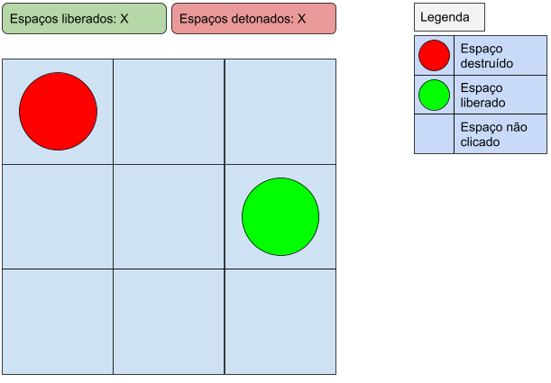

# Campo Minado

## Regras

Deve ser criada uma **matriz 3x3** que simula um campo minado. Ao clicar em um espaço deve ser revelado se o mesmo tem ou não uma mina e atualizar o contador de espaços liberados ou de espaços detonados. Dentre os espaços devem ser distribuídas **4 minas aleatoriamente**. E ao final do jogo deve ser mostrado um alerta dizendo se o jogador venceu ou perdeu. 

## Final

O jogador **ganha** quando os 5 espaços livres forem revelados e o jogador **perde** quando as 4 minas foram detonadas.

## Sugestão de modelo de UI

